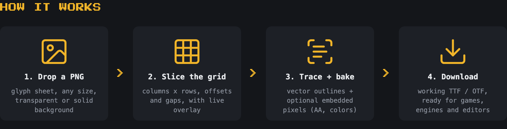

# bitmap2font

**[Try it in your browser on itch.io](https://stmn.itch.io/bitmap2font)**

Turns a PNG sheet of pixel glyphs into a real **TTF / OTF** font, entirely in the browser. Drop a
sheet with glyphs laid out in a grid, type the characters in reading order, download the font. The
counterpart of [font2bitmap](https://stmn.itch.io/font2bitmap). No server, no build step - the whole
tool is static HTML/CSS/JS.

## What it does

- **Input**: a PNG glyph sheet (any size, transparent or solid background - ink is detected
  automatically), or a ready bitmap font: **BDF** (X11), **BMFont** `.fnt` (text and binary) with its
  PNG atlas, **Windows `.FON` / `.FNT`**.
- **Grid**: columns x rows or cell size, offsets and gaps, live overlay on the sheet. The grid is
  guessed on upload for most sheets.
- **Metrics**: baseline (descender room), monospace or proportional (glyphs trimmed to their pixels,
  spaced by a letter gap), space width, binarisation threshold.
- **Fallback glyph**: pick a character from the list whose glyph is also stored as the font's
  `.notdef`, so engines that use a single font show your own "tofu" for characters the font does
  not have.
- **Output**: OTF and TTF with clean vector outlines (pixels merged into contours, no seams), plus a
  **BMFont** export (`.fnt` + atlas PNG in a zip) for Phaser, LibGDX, HaxeFlixel, MonoGame and the
  Unity TMP converters.
- **Color font mode**: antialiased or coloured sheets keep their exact pixels - every glyph is
  embedded as PNG in the TTF (`CBDT`/`CBLC` + `sbix`), optionally with vector **COLR** layers, and
  a bake scale for crisp upscaling. Enabled automatically when the sheet has AA or colours. Outline
  fallback stays in the file for renderers without colour support.
- **Preview**: live text preview with the generated font, baseline guide, and an embedded-bitmap
  preview for browsers that cannot render colour fonts.
- The form and the sheet are remembered in `localStorage`, so a session can be picked up later.

### Where colour fonts render

Colour glyphs: Chrome / Edge / Opera, Safari and macOS apps, Godot and anything on FreeType,
Windows DirectWrite apps. Outline fallback only: Firefox (COLR only), Unity TextMeshPro,
stb_truetype-based engines, older design apps. The file always contains both.

## Run locally

    npm install
    npm run dev          # serves dist/ at http://localhost:8741 without caching

Everything the app needs is in `dist/`. `vendor/vendor.js` bundles opentype.js and fonteditor-core;
rebuild it after changing those dependencies:

    npx esbuild src/vendor-entry.js --bundle --format=iife --minify --outfile=dist/vendor/vendor.js

## Tests

    npm test

The font pipeline runs in node as well, so the tests build fonts from synthetic sheets and the files
in `test-files/` and parse the results back. The COLR test also validates the font with fontTools
when a Python with it is available: `B2F_PYTHON=/path/to/venv/bin/python npm test`; without it
that single check is skipped with a notice.

## Publishing to itch.io

    npm run zip          # packs dist/ into bitmap2font-itch.zip

Upload the zip as an HTML project, tick "This file will be played in the browser", viewport at
least 1000x800, "Mobile friendly" on (the layout is responsive).

## Files

- `dist/core.js` - the pipeline: binarisation, grid slicing, contour tracing, font building, COLR
  layers (pure module, runs in node)
- `dist/colorfont.js` - PNG encoder and the `CBDT`/`CBLC`/`sbix`/`COLR`/`CPAL` table writers
- `dist/importers.js` - BDF, BMFont and Windows FON/FNT readers
- `dist/bmfont.js` - BMFont exporter (`.fnt` + atlas, zipped)
- `dist/app.js`, `dist/index.html`, `dist/style.css` - interface, preview, session
- `dist/example.png` - the bundled example sheet: Press Start 2P (OFL), ASCII 32-126, 8x8 cells
- `src/` - entry points for the vendor and tooltip bundles
- `test/` - node tests; `test-files/` - one sample of every supported input format
- `promo/` - the itch.io cover and guide images and the HTML they are rendered from

## Credits

Font building: [opentype.js](https://github.com/opentypejs/opentype.js) and
[fonteditor-core](https://github.com/kekee000/fonteditor-core). Tooltips:
[Tippy.js](https://atomiks.github.io/tippyjs/). Icons: [Lucide](https://lucide.dev) (ISC licence),
inlined. Example sheet: [Press Start 2P](https://fonts.google.com/specimen/Press+Start+2P) by
CodeMan38 (OFL).
